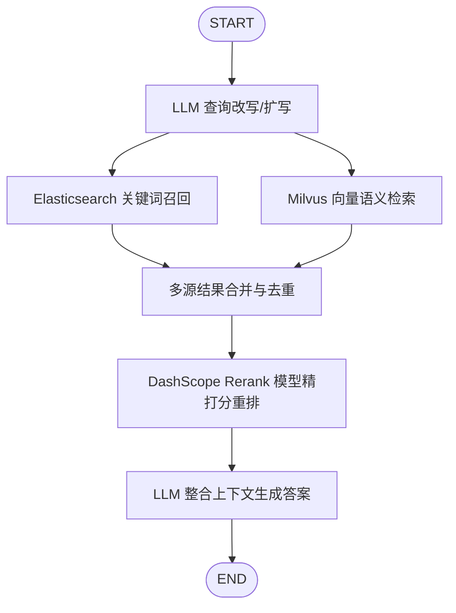

# 19_elastic-search-test - 混合检索与重排 RAG 系统演示

本项目演示了一个基于大语言模型、Elasticsearch 关键词检索、Milvus 语义向量检索的 **多路混合检索与重排（Hybrid Retrieval & Rerank）RAG** 系统。整个检索与生成工作流使用 **LangGraph** 进行状态图的声明式编排，确保多路并行分支运行的协调性。

---

## 🌟 核心功能架构

整个 RAG 系统的工作流可以用以下的 LangGraph 拓扑图进行可视化：



1. **查询改写/扩写 (Query Augmentation)**：利用大语言模型（绑定 Zod Schema 进行结构化输出）将用户的提问进行多维度改写与扩写，输出另外 3 条侧重点不同的相似问句，以提升多路检索对错别字、口语俗语和语义变体召回的鲁棒性。
2. **双路并行召回 (Hybrid Recall)**：
   - **分词全文检索 (ES)**：使用 Elasticsearch 并配置 `ik_max_word` 细粒度分词与 `ik_smart` 粗粒度检索对 4 条检索句执行 `multi_match` 查询，重点对标题匹配赋予更高权重。
   - **向量语义检索 (Milvus)**：利用阿里百炼向量模型对 4 条检索句批量生成 Dense Vector，并在 Milvus 中执行近邻向量检索。
3. **合并去重 (Merge & Deduplicate)**：收集两路检索召回的文档，只按文档的唯一标识 `metadata.id` 保持原序去重，消除由于多句子与双引擎产生的大量冗余。
4. **重排精筛 (Reranker)**：通过百炼 API 的 `DashScopeRerank` 重排模型服务，重新计算用户问题与去重后候选文档的相关度，精准截取 Top 3 最相关的文档片段。
5. **整合生成 (Generation)**：拼接 Top 3 文档为上下文提示词，连同原始问题传给大语言模型，并结合系统 Prompt 约束，生成精简、客观、有理有据的答复。

---

## 📂 目录结构与模块说明

```text
├── docker-compose.yml       # 底层服务编排（Elasticsearch, Kibana, Milvus, Attu 向量库管理端）
├── package.json             # 依赖管理，包含 LangChain/LangGraph 生态和 ES/Milvus 客户端
├── tsconfig.json            # TypeScript 编译配置
├── README.md                # 项目整体使用说明文档
└── src/
    ├── rerank/
    │   ├── 01-dashscope-rerank.ts   # 自定义实现的阿里百炼 Rerank 压缩器类（集成于 LangChain BaseDocumentCompressor）
    │   └── 02-test.ts               # Rerank 服务独立验证测试脚本
    └── rag/
        ├── 01-seedata.ts            # 测试生活笔记的数据双写初始化脚本（写 ES + 写 Milvus + 向量化）
        ├── 02-query-augment.ts      # 大模型查询多维度改写扩写逻辑模块
        └── 03-hybrid-retrieval.ts   # 使用 LangGraph 编排的混合检索 RAG 主测试脚本
```

---

## 🛠️ 快速跑测指南

### 第一步：启动基础服务容器
在 `19_elastic-search-test` 根目录下，运行 Docker 启动命令，初始化存储环境：
```bash
docker compose up -d
```
*(这会启动 Elasticsearch 端口 9200，以及 Milvus 端口 19530，并启动配套的 Kibana 和 Attu 向量可视化工具。)*

### 第二步：配置环境变量

### 第三步：写入初始化数据
运行数据写入脚本，系统会对 10 条测试的日常生活笔记（如：周末煲汤、遛狗路线、阳台浇水、路由器断流等）进行向量化，并覆盖写入 Elasticsearch 和 Milvus 数据库：
```bash
npx tsx src/rag/01-seedata.ts
```

### 第四步：执行端到端混合检索 RAG 跑测
运行 RAG 主脚本，脚本将编译 LangGraph 流程，打印拓扑结构图，并调用混合检索流解答测试问题（例如“家里无线老是断断续续的咋整啊”）：
```bash
npx tsx src/rag/03-hybrid-retrieval.ts
```
*(你将在终端直观地看到查询扩写出的检索词、ES 关键词召回的文档、Milvus 向量检索到的文档、Rerank 精筛后保留的文档，以及最终由大模型总结输出的回答。)*
