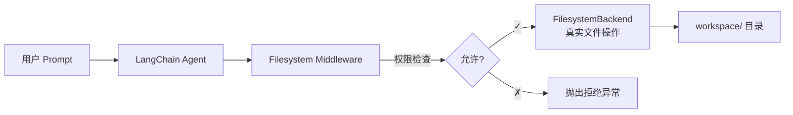
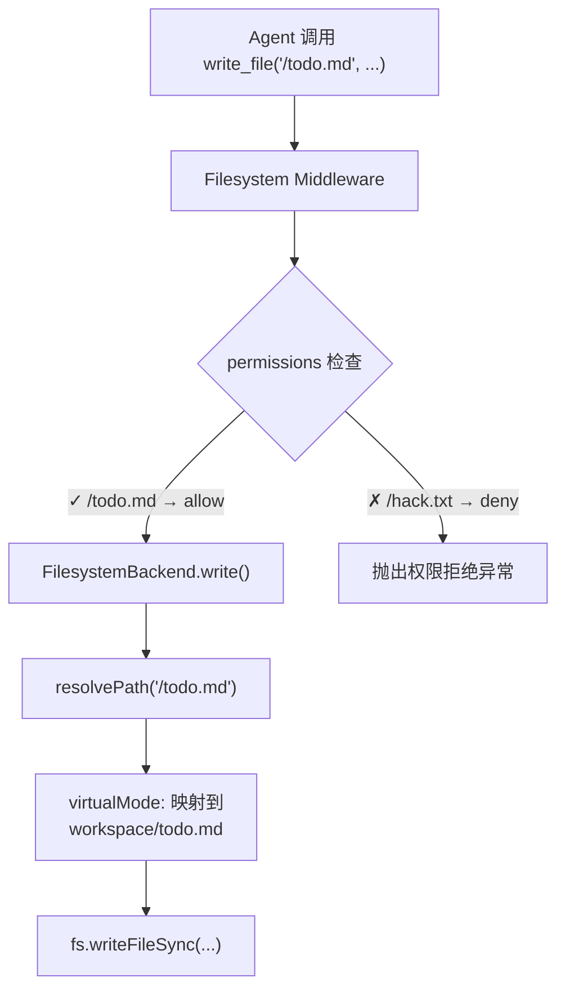
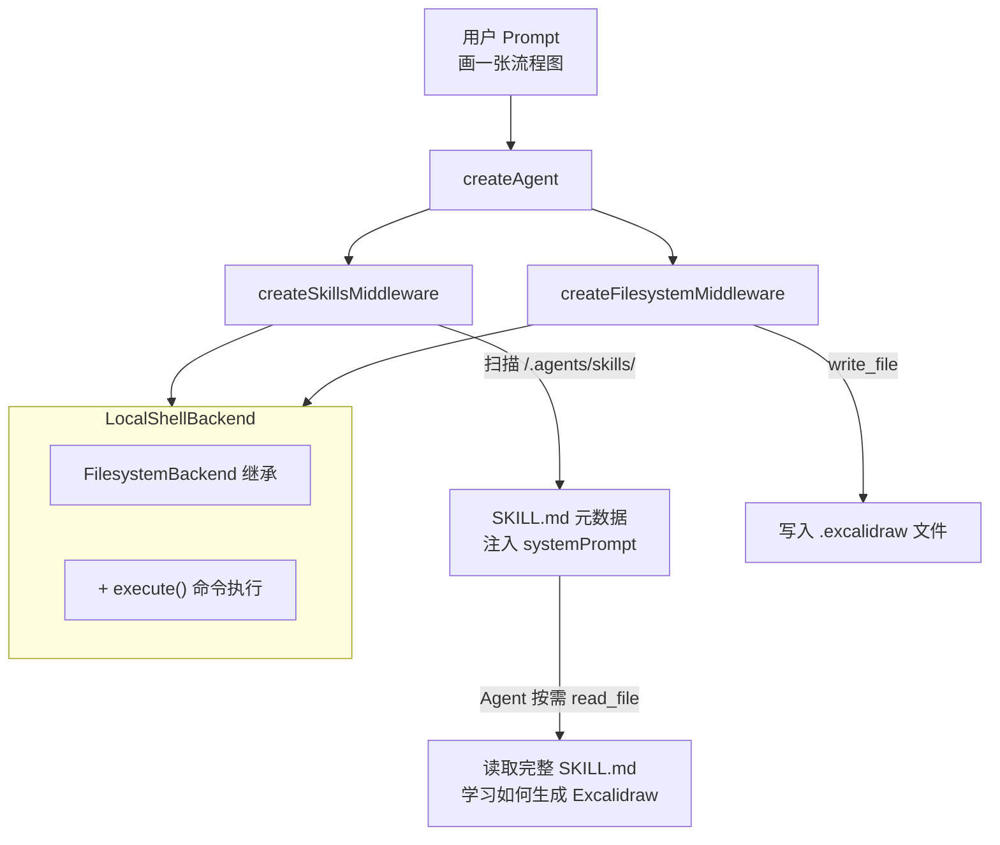
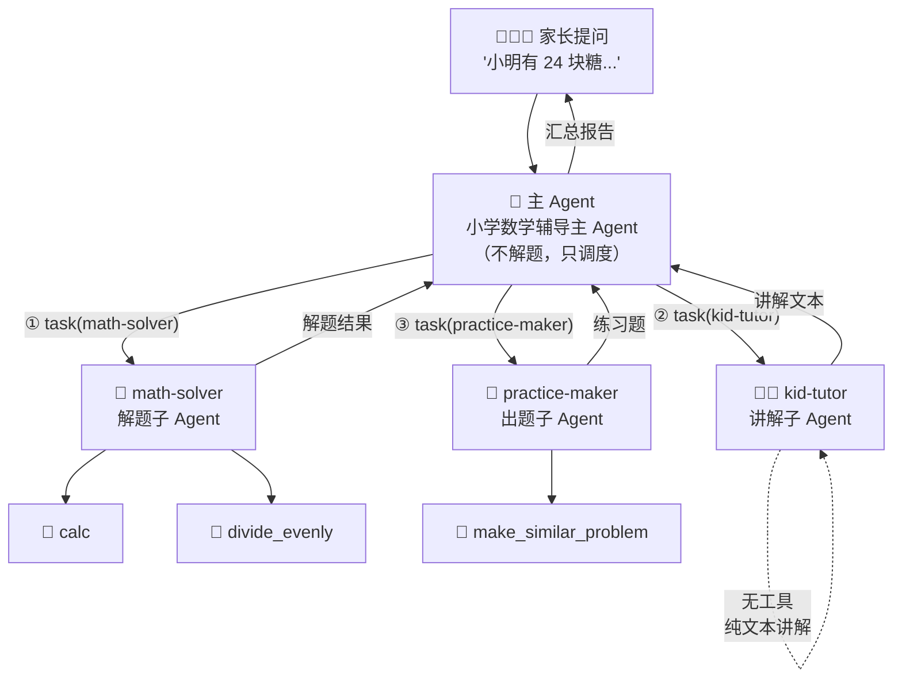
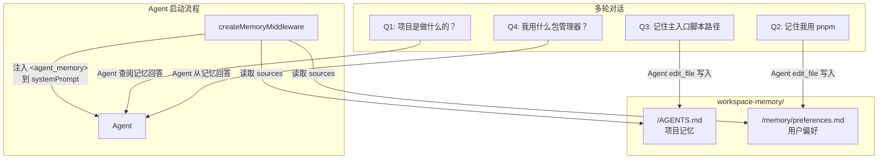
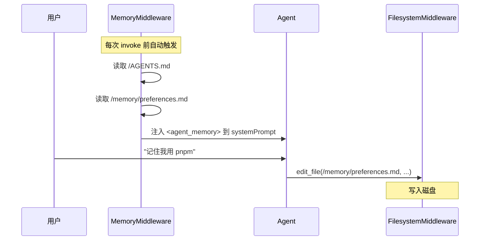
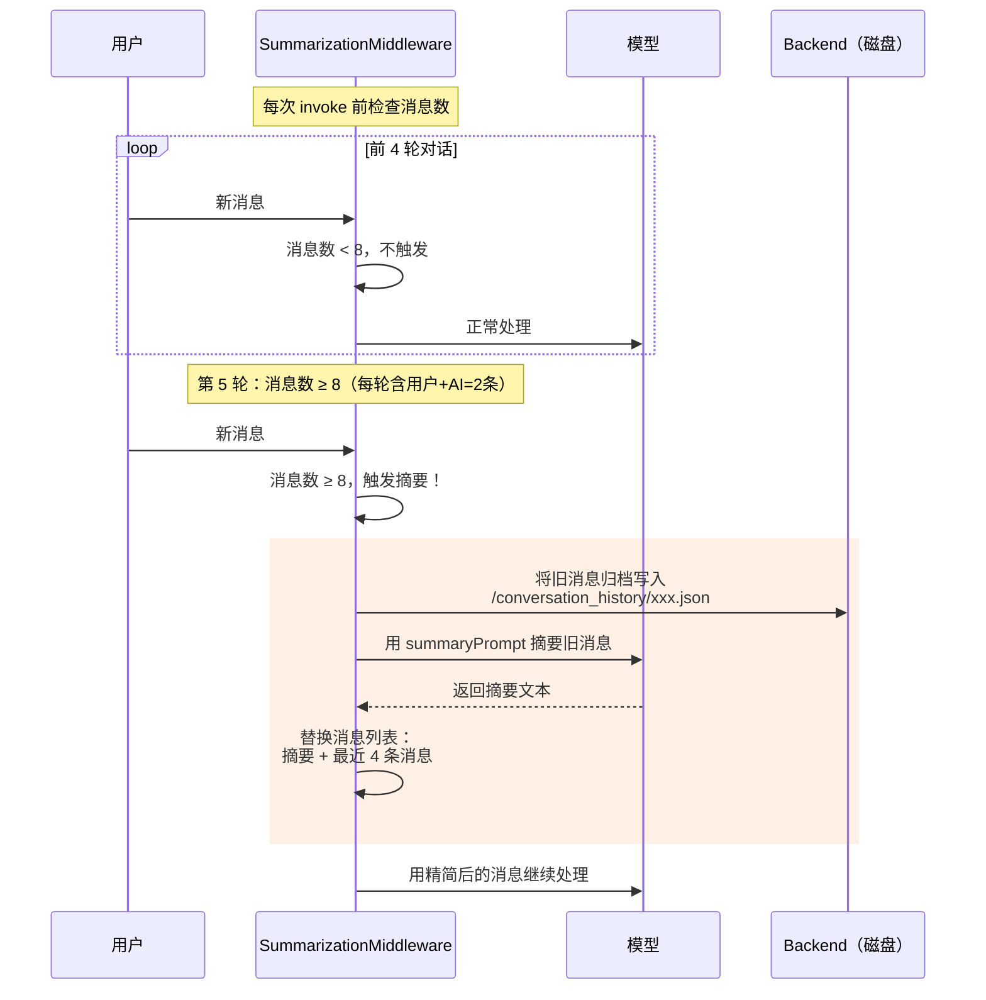

# Document Analysis

## 01-filesystem-agent.ts

基于 **DeepAgents + LangChain** 框架的 **文件系统 Agent 演示**，核心目的是展示如何通过 **中间件（Middleware）** 对 AI Agent 的文件操作实施 **权限控制**。

**整体流程：**

**数据流全景：**

这个文件演示了 **DeepAgents 框架中 Middleware 的安全能力**：在不修改 Agent 核心逻辑的前提下，通过声明式的权限规则，控制 AI 对文件系统的访问边界。这在生产环境中非常重要——防止 LLM 被 prompt injection 引导去读写敏感文件。

**API 解释：**

`createFilesystemMiddleware`：创建文件系统的中间件

`backend`：是一个实现了 BackendProtocolV2 接口的文件操作后端示例。是中间件的 **“执行引擎”**。本质是 DeepAgents 框架中的基础设施层抽象，让各种中间件可以通过统一的接口访问底层资源。

`FilesystemBackend`：是 DeepAgents 提供的本地文件系统后端，之间操作磁盘上的真实文件

---

## 02-skills-agent.ts

基于 **DeepAgents Skills 中间件** 的 Agent 演示，核心目的是展示如何让 AI Agent **加载并使用社区共享的技能（Skills）** 来完成复杂任务——这里的任务是用自然语言描述生成一张 Excalidraw 流程图。

**整体流程：**

---

## 03-subagent-agent.ts

基于`createSubAgentMiddleware` 中间件的演示，场景是 **小学数学应用题辅导**。一个主 Agent 充当"调度员"，将解题、讲解、出题三个任务分别委派给三个专业化的子 Agent。

**整体流程：**

---

## 04-memory-agent.ts

基于`createMemoryMiddleware` 中间件的演示，展示如何让 AI Agent 拥有 **跨轮次持久化记忆**——Agent 能记住用户告诉它的信息，并在后续对话中自动回忆。

**整体流程：**

> 这种"分类记忆"设计很实用——项目记忆可以团队共享（提交到 Git），而用户偏好是个人私有的（加入 `.gitignore`）

**Agent 既是记忆的消费者也是生产者**。Memory Middleware 负责"回忆"（读取并注入），Filesystem Middleware 负责"记忆"（Agent 主动写入）。两者通过共享同一个 `backend` 实例形成闭环。

---

## 05-summarization-agent.ts

文件演示了 **DeepAgents 的 `createSummarizationMiddleware`** —— 一个自动压缩长对话历史的中间件。核心思路是：当对话消息数超过阈值时，自动将早期对话摘要为一段精简文本，以控制上下文窗口长度。

**整体流程：**

